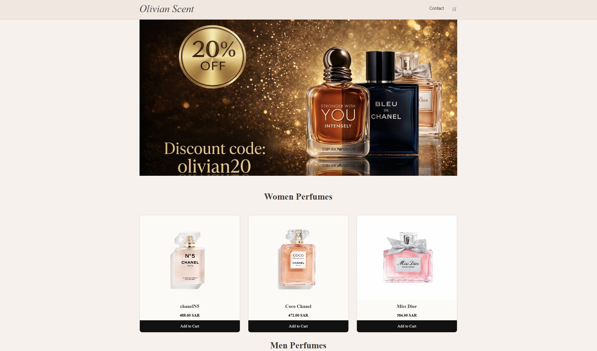

Olivian Scent

A perfume e-commerce web application developed as a university project. The website provides a shopping experience where users can browse perfumes,
add products to their cart and complete a checkout process, while administrators can manage the product catalog through a dedicated dashboard.

Overview:
Olivian Scent was developed to simulate a basic online perfume store. The project focuses on implementing the core functionality of an e-commerce website,
including product browsing, shopping cart management, checkout, and an administration panel for managing products.

Features: 
- Browse available perfume products
- View product information
- Add and remove products from the shopping cart
- Simple checkout process
- Contact page
-  Admin login
- dd new products
- Edit existing products
- Delete products

Technologies Used: 
- PHP
- MySQL
- HTML5
- CSS3
- XAMPP
- phpMyAdmin

Prerequisites:
- XAMPP
- PHP
- MySQL

# Installation:
1. Clone the repository.
git clone https://github.com/Loj001/olivian-scent.git
2. Move the project folder into:
xampp/htdocs/
3. Start **Apache** and **MySQL** from XAMPP.
4. Import the SQL database into **phpMyAdmin**.
5. Open your browser:
http://localhost/olivian-scent/

Future Improvements:
- User registration and authentication
- Online payment integration
- Product search and filtering
- Order tracking
- Customer accounts
- Responsive mobile optimization

License:
This project was developed for educational purposes as part of a university Software Engineering course.
